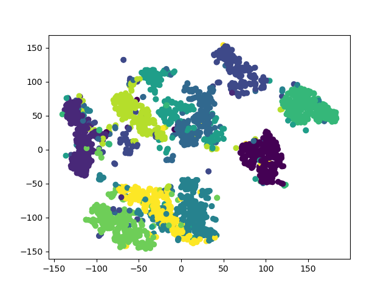

# EC526 Project
> Parallel t-Distributed Stochastic Neighbor Embedding

## Group Member
* Fengxu Tu
* Yuhao Zhou

## Technical Report
See [`Documentation/Report_EC526.pdf`](./Documentation)

## Requirements
* `GCC Version 9.3.0`: local setup, but any reasonable version (i.e. >= GCC 5) should work properly.
* `Python 3`: plotting
    * `numpy`
    * `matplotlib`
* `Linux or macOS`
    * We are using `make` and shell script in our project. For other system users (e.g. Windows users), please manually build the source and run it.

## Build & Run
```shell script
cd ./tsne
```
### OpenMP build
* Build and Plot on MNIST: `make test_mnist_plot`
* Build and Plot on IRIS: `make test_iris_plot`
* Only Binary on MNIST: `make tets_mnist`
* Only Binary on IRIS: `make test_iris`

### Single Thread Build
* MNIST: `make no_parallel`
* IRIS: `make no_parallel_iris`

## Manually Build

### Compile Binary
```shell script
g++ -O2 [EXTRA_FLAGS] test.cpp -o $OUTBIN 
```
Using `[EXTRA_FLAGS]` to switch version:
* `-D NO_PARALLEL`: Do not use OpenMP
* `-D IRIS`: Training on IRIS dataset

### Run Binary
```shell script
./$OUTBIN
```
### Plot
```shell script
python3 plot_iris.py
# OR
python3 plot_mnist.py
```
## Run On SCC
Modify the comment line to request for a specific number of CPU.
```shell script
qsub scc_run.sh
```

## Sample Plots
### Iris Dataset
The original plot of Iris Dataset (The first two dimensions):


After processing:


### MNIST Dataset
The original plot of MNIST Dataset (Computing mean to reduce 784 data dimensions to 2d):


After processing:




## Performance Evaluation
### Local Env

* As we can see in this figure, OpenMP version is faster than the Single thread version.
* The right side of this figure shows that the OpenMP version uses 6 threads and the `nop` version only uses one. 

### SCC Env
#### OpenMP Running
```shell script
./test_mnist
# Reading Data ...
# tSNE Start ...
# Computing P-values ...
# Time Spent: 0ms
# Start Gradient Descent ...
# Iter: 100, err: 8.54428, time: 14s
# Iter: 200, err: 0.361679, time: 14s
# Iter: 300, err: 0.358529, time: 14s
# Iter: 400, err: 0.357205, time: 13s
# Iter: 500, err: 0.35648, time: 14s
# Iter: 600, err: 0.356172, time: 14s
# Iter: 700, err: 0.355964, time: 14s
# Iter: 800, err: 0.355953, time: 14s
# Iter: 900, err: 0.355953, time: 13s
# Iter: 1000, err: 0.355953, time: 14s
```

#### Single Thread Running
```shell script
./test_mnist_nop
# Reading Data ...
# tSNE Start ...
# Computing P-values ...
# Time Spent: 3989ms
# Start Gradient Descent ...
# Iter: 100, err: 8.54428, time: 42s
# Iter: 200, err: 0.361679, time: 38s
# Iter: 300, err: 0.358529, time: 37s
# Iter: 400, err: 0.357205, time: 37s
# Iter: 500, err: 0.35648, time: 37s
# Iter: 600, err: 0.356172, time: 37s
# Iter: 700, err: 0.355964, time: 37s
# Iter: 800, err: 0.355953, time: 37s
# Iter: 900, err: 0.355953, time: 37s
# Iter: 1000, err: 0.355953, time: 37s
```

As we can see in the log, the OpenMP implementation is ~2.7x faster than the single thread implementation.
